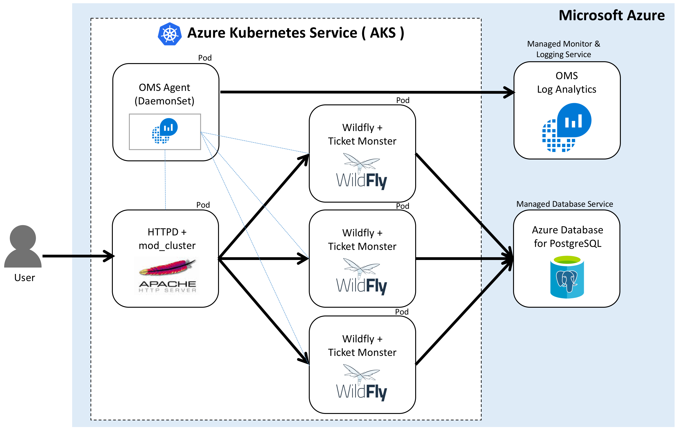

# azure-k8s-daas-ticketmonster-demo
Ticket-Monster HA Cluster Demo using Azure Kubernetes Services (AKS) and Managed PostgreSQL



This project contains files that allows you to run [Ticket Monster](https://developers.redhat.com/ticket-monster/) on a [WildFly](http://www.wildfly.org/) server on [Azure Kubernates Services(AKS)](https://docs.microsoft.com/en-us/azure/aks/) + using [Azure Database for PostgreSQL](https://docs.microsoft.com/en-us/azure/postgresql/) and [OMS/LogAnalytic Service](https://docs.microsoft.com/en-us/azure/log-analytics/log-analytics-containers) in Azure. This project is a fork of the [devops-demo](https://github.com/rafabene/devops-demo) by [rafabene](https://github.com/rafabene).

The pieces of this demo are:

- Apache HTTPD + mod_cluster
    - Deployment (Replica Set, Pod)
    - Service
- Wildfly 10.x Application Server + Ticket Monster application
    - Deployment (Replica Set, Pod)
- OMS + Log Analytics Agent
    - DaemonSet (Pod)
    - Client Daemon Set for Managed Monitor and Log Analytics Service in Azure

- Azure Database for Postgres 9.5 or 9.6
    - Managed PostgreSQL Service in Azure

## 2. Preparations
### A. Azure Database for Postgres
1-1. Create an Azure Database for PostgreSQL server by following this guide - Create an Azure Database for PostgreSQL using [the Azure CLI](https://docs.microsoft.com/en-us/azure/postgresql/quickstart-create-server-database-azure-cli) or [the Azure portal](https://docs.microsoft.com/en-us/azure/postgresql/quickstart-create-server-database-portal)

1-2. Add firewall rule to whitelist the IP range for connectivity by following this guide - Configure a server-level firewall rule using [the Azure CLI](https://docs.microsoft.com/en-us/azure/postgresql/tutorial-design-database-using-azure-cli#configure-a-server-level-firewall-rule) or [the Azure Portal](https://docs.microsoft.com/en-us/azure/postgresql/tutorial-design-database-using-azure-portal#configure-a-server-level-firewall-rule). 

1-3. Once you have your account and database in Azure Database for Postgres, create a database named **ticketmonster**:
```
create database ticketmonster;
```

1-4. Finally, replace the environment variables part of kubernetes/wildfly-server.yaml file with your accounts info:
```
containers:
- name: wildfly
    image: yoichikawasaki/wildfly-ticketmonster-ha:1.0
    env:
    - name: POSTGRES_HOST
        value: <myaccount>.postgres.database.azure.com
    - name: POSTGRES_PORT
        value: "5432"
    - name: POSTGRES_USER
        value: <myuser>@<myaccount> # Server admin login name of Azure DB for PostgreSQL
    - name: POSTGRES_PASSWORD
        valueFrom:
          secretKeyRef:
            name: <mysecret>
            key: <key-for-password>
```
For **POSTGRES_PASSWORD** env value above, you need to create a secret to store your password for Postgres (sensitive data). Please follow [Secrets Operations](docs/secret-operations.md) to create a secret and add secret name (mysecret) and key (key-for-password) above.
- [Secrets Operations](docs/secret-operations.md).

### 2. OMS + Log Analytics

2-1. Create a new OMS workspace and get a workspace ID and primary key for it by following this guide - [Configure the monitoring solution](https://docs.microsoft.com/en-us/azure/aks/tutorial-kubernetes-monitor#configure-the-monitoring-solution).

2-2. Once you have the workspace ID and primary key of your OMS workspace, replace the values for WSID and KEY with your values in oms-daemonset.yaml.
```
containers:
- name: omsagent
    image: "microsoft/oms"
    imagePullPolicy: Always
    env:
    - name: WSID
        value: <WSID>
    - name: KEY
        value: <KEY>
```

### 3. Container images for a Ticket-Monster App
You can basically use a default container image ([yoichikawasaki/wildfly-ticketmonster-ha:1.0](https://hub.docker.com/r/yoichikawasaki/wildfly-ticketmonster-ha/)) for the Ticket-Monster app. However if you want to use your custom app, create a container image and push it to a container registry. Once you have a container image registered in the registry, replace the container image part of kubernetes/wildfly-server.yaml file with your container image:tag name.

```
containers:
- name: wildfly
    image: yoichikawasaki/wildfly-ticketmonster-ha:1.0
```

## Creating and Running AKS Cluster

### 1. Create AKS Cluster
First of all, update latest azure-cli in case that you're operating locally, NOT using [Azure Cloud Shell](https://docs.microsoft.com/en-us/azure/cloud-shell/overview):
```
pip install -U azure-cli
```

Enable AKS preview for your Azure subscription by running the following command (Only in preview period):
```
az provider register -n Microsoft.ContainerService
```

Create resource group (Resource group named RG-aks in eastus region):
```
az group create --name RG-aks --location eastus
```

Create AKS Cluster ( a cluster named myAKSCluster in a resource group named RG-aks with cluster node count=1 and a new SSH key):
```
az aks create --resource-group RG-aks --name myAKSCluster --node-count 1 --generate-ssh-keys
```
If you already have a ssh key generated, specify your SSH key with --ssh-key-value option instead of --generate-ssh-keys in creating AKS Cluster:
```
az aks create --resource-group RG-aks --name myAKSCluster --node-count 1 --ssh-key-value ~/.ssh/id_rsa_aks.pub
```

### 2. Install the kubectl CLI and connect to the cluster with kubectl

If you want to install it locally, run the following command:
```
az aks install-cli
```
Then, run the following command to configure kubectl to connect to your Kubernetes cluster, run the following command:
```
az aks get-credentials --resource-group=RG-aks --name=myAKSCluster
```
Check if you can connect to the cluster by running the kubectl command:
```
kubectl get nodes

(SAMPLE OUTPUT)
NAME                       STATUS    ROLES     AGE       VERSION
aks-nodepool1-17576119-0   Ready     agent     6m        v1.7.7
```

### 3. Deploy Applications

Install the Apache HTTPD + modcluster by running the following commands:
```
kubectl create -f <repodir>/kubernetes/modcluster.yaml --record
kubectl create -f <repodir>/kubernetes/modcluster-service.yaml --record
```

Install the Wildfly Servers by running the following command ([NOTE] You don't need to create a Service for the Wildfly as it only act as a backend):
```
kubectl create -f <repodir>/kubernetes/wildfly-server.yaml --record
```

Install the Wildfly Servers by running the following command
```
kubectl create -f <repodir>/kubernetes/oms-daemonset.yaml --record
```


Check all the deployments status:
```
kubectl get pod,rs,svc,deploy,ds -l context=AKSDemo

(SAMPLE OUTPUT)
NAME                            READY     STATUS    RESTARTS   AGE
po/modcluster-500718032-kfb17   1/1       Running   0          1h
po/omsagent-hsc5r               1/1       Running   0          57s
po/wildfly-1364584080-2qswl     1/1       Running   0          1h
po/wildfly-1364584080-mpmgh     1/1       Running   0          1h
po/wildfly-1364584080-t5q9t     1/1       Running   0          1h

NAME                      DESIRED   CURRENT   READY     AGE
rs/modcluster-500718032   1         1         1         1h
rs/wildfly-1364584080     3         3         3         1h

NAME             TYPE           CLUSTER-IP    EXTERNAL-IP     PORT(S)        AGE
svc/modcluster   LoadBalancer   10.0.13.220   13.92.171.134   80:30000/TCP   1h

NAME                DESIRED   CURRENT   UP-TO-DATE   AVAILABLE   AGE
deploy/modcluster   1         1         1            1           1h
deploy/wildfly      3         3         3            3           1h

NAME          DESIRED   CURRENT   READY     UP-TO-DATE   AVAILABLE   NODE SELECTOR                 AGE
ds/omsagent   1         1         1         1            1           beta.kubernetes.io/os=linux   58s
```
Take note of the EXTERNAL-IP for services/modcluster.

### 4. Access the applications:

Check /mcm (mod_cluster manager):
```
open http://<modcluster external ip>/mcm
```

Access Ticket-Monster application:
```
open http://<modcluster external ip>/ticket-monster/
```

## Operations 
- [AKS Cluster Operations](docs/aks-operations.md)
- [Kubernetes App Operations](docs/k8s-operations.md)
- [Secrets Operations]((docs/secret-operations.md))

## LINKS
- [Azure Kubernates Services(AKS)](https://docs.microsoft.com/en-us/azure/aks/)
- [Azure Database for PostgreSQL](https://docs.microsoft.com/en-us/azure/postgresql/)
- [OMS/LogAnalytic Service](https://docs.microsoft.com/en-us/azure/log-analytics/log-analytics-containers)
- [Monitor Azure Container Service (AKS)](https://docs.microsoft.com/en-us/azure/aks/tutorial-kubernetes-monitor)
