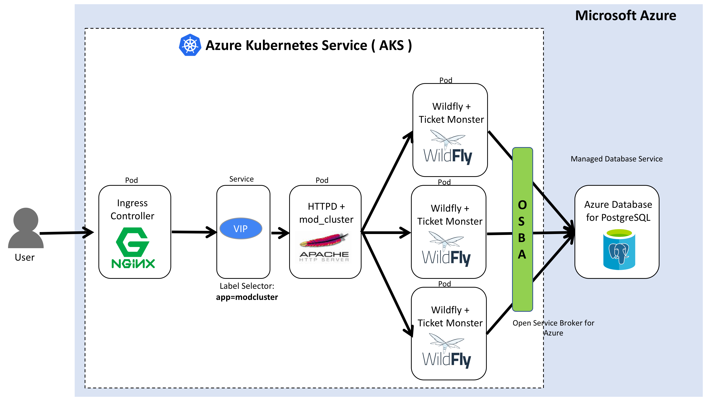

# azure-k8s-daas-ticketmonster-demo
Ticket-Monster HA Cluster Demo using Azure Kubernetes Services (AKS) and Managed PostgreSQL

This project contains files that allows you to run [Ticket Monster](https://developers.redhat.com/ticket-monster/) on a [WildFly](http://www.wildfly.org/) server on [Azure Kubernates Services(AKS)](https://docs.microsoft.com/en-us/azure/aks/) + using [Azure Database for PostgreSQL](https://docs.microsoft.com/en-us/azure/postgresql/) and [OMS/LogAnalytic Service](https://docs.microsoft.com/en-us/azure/log-analytics/log-analytics-containers) in Azure. This project is a fork of the [devops-demo](https://github.com/rafabene/devops-demo) by [rafabene](https://github.com/rafabene)

## Demo Architecture and Components
- Cluster1

- Cluster2

The pieces of this demo are:

- NGINX Ingress Controller
    - HTTP Router (Service, Deployment, ReplicaSet, Pod)
- Apache HTTPD + mod_cluster
    - Service, Deployment,Replica Set, Pod
- Wildfly 10.x Application Server + Ticket Monster application
    - Deployment, Replica Set, Pod
- Postgres 9.x Database Server
    - Service, Deployment,Replica Set, Pod, Secret
- Azure Database for Postgres 9.5 or 9.6
    - Managed PostgreSQL Service in Azure
- Open Service Broker API for Azure
- Log Analytics Agent
    - DaemonSet
    - Client Daemon Set for Managed Monitor and Log Analytics Service in Azure

### Procedures
- [0. Preparations](docs/00-preparations.md)
- [1. Create AKS Cluster](docs/01-create-aks-cluster.md)
- [2. Deploy Applications (Cluster1)](docs/02-deploy-apps.md)
- [3. Manage AKS Cluster with Azure CLI](docs/03-manage-aks-cluster.md)
- [4. Provision, bind and consume PostgreSQL PaaS using OSBA](docs/04-osba-postgresql.md)
- [5. Monitoring with Loganalytics](docs/05-monitoring-with-oms-loganalytics.md)
- [6. Scale out Pods and Nodes (Cluster2)](docs/06-scale-out-pod-node.md)
- Extras:
    - [Manage Kubernetes App with kubectl](docs/k8s-operations-with-kubectl.md)
    - [Secrets Operations](docs/secret-operations.md)
    - [Monitoring with Prometheus and Grafana](docs/monitoring-with-prometheous-grafana.md)

## LINKS
- [Azure Kubernates Services(AKS)](https://docs.microsoft.com/en-us/azure/aks/)
- [Azure Database for PostgreSQL](https://docs.microsoft.com/en-us/azure/postgresql/)
- [OMS/LogAnalytic Service](https://docs.microsoft.com/en-us/azure/log-analytics/log-analytics-containers)
- [Monitor Azure Container Service (AKS)](https://docs.microsoft.com/en-us/azure/aks/tutorial-kubernetes-monitor)
- [Ticket Monster Github Repo](https://github.com/jboss-developer/ticket-monster)
