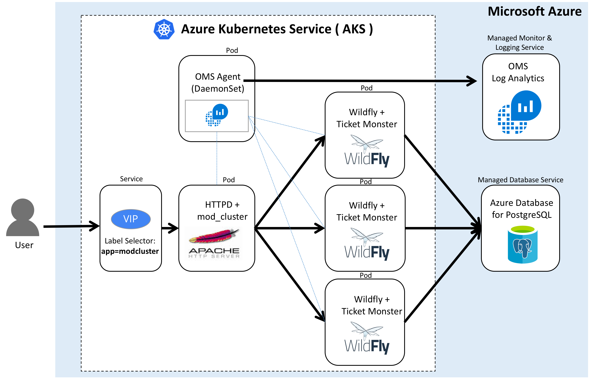
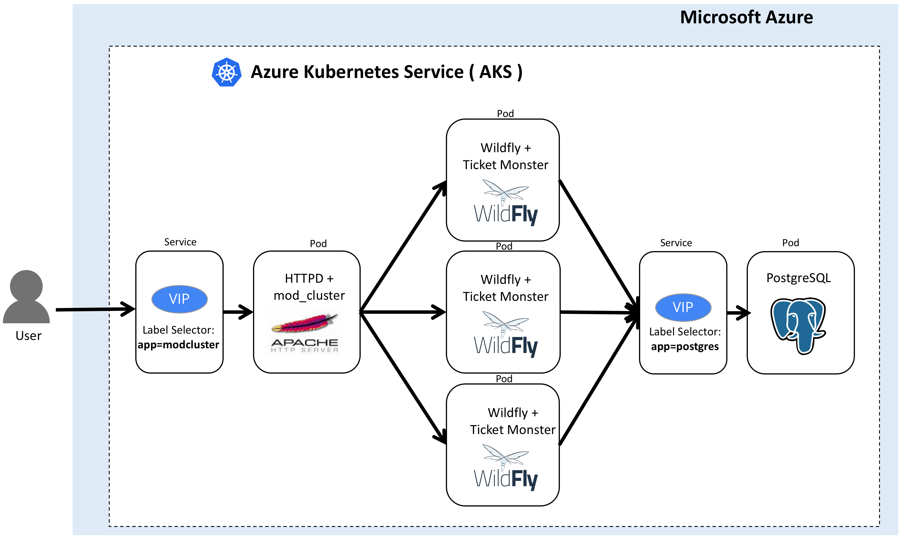

# azure-k8s-daas-ticketmonster-demo
Ticket-Monster HA Cluster Demo using Azure Kubernetes Services (AKS) and Managed PostgreSQL

This project contains files that allows you to run [Ticket Monster](https://developers.redhat.com/ticket-monster/) on a [WildFly](http://www.wildfly.org/) server on [Azure Kubernates Services(AKS)](https://docs.microsoft.com/en-us/azure/aks/) + using [Azure Database for PostgreSQL](https://docs.microsoft.com/en-us/azure/postgresql/) and [OMS/LogAnalytic Service](https://docs.microsoft.com/en-us/azure/log-analytics/log-analytics-containers) in Azure. This project is a fork of the [devops-demo](https://github.com/rafabene/devops-demo) by [rafabene](https://github.com/rafabene).

Demo clusters in the project: 
- Cluster1: Azure Kubernetes Services (AKS) and Azure PaaS Services
- Cluster2: All in Azure Kubernetes Services (AKS)

## Cluster1: Azure Kubernetes Services (AKS) and Azure PaaS Services

The pieces of this demo are:

- Apache HTTPD + mod_cluster
    - Deployment (Replica Set, Pod)
    - Service
- Wildfly 10.x Application Server + Ticket Monster application
    - Deployment (Replica Set, Pod)
- OMS + Log Analytics Agent
    - DaemonSet (Pod)
    - Client Daemon Set for Managed Monitor and Log Analytics Service in Azure

- Azure Database for Postgres 9.5 or 9.6
    - Managed PostgreSQL Service in Azure

### Cluster1 Procedures
- [Preparations (Azure PaaS Setup)](docs/preparations-cluster1.md)
- [Create AKS Cluster](docs/create-aks-cluster.md)
- [Deploy Applications](docs/deploy-cluster1-apps.md)
- [AKS Cluster Operations](docs/aks-operations.md)
- [Kubernetes App Operations](docs/k8s-operations.md)
- [Secrets Operations](docs/secret-operations1.md)
- Monitoring and Alerting with OMS/Loganalytics
- CI/CD pipeline

## Cluster2: All in Azure Kubernetes Services (AKS)

The pieces of this demo are:

- Apache HTTPD + mod_cluster
    - Deployment (Replica Set, Pod)
    - Service
- Wildfly 10.x Application Server + Ticket Monster application
    - Deployment (Replica Set, Pod)
- Postgres 9.x Database Server
    - Deployment (Replica Set, Pod)
    - Service

### Cluster2 Procedures
- [Create AKS Cluster](docs/create-aks-cluster.md)
- [Deploy Applications](docs/deploy-cluster2-apps.md)
- [AKS Cluster Operations](docs/aks-operations.md)
- [Kubernetes App Operations](docs/k8s-operations.md)
- [Secrets Operations](docs/secret-operations2.md)
- Monitoring and Alerting
- CI/CD pipeline

## LINKS
- [Azure Kubernates Services(AKS)](https://docs.microsoft.com/en-us/azure/aks/)
- [Azure Database for PostgreSQL](https://docs.microsoft.com/en-us/azure/postgresql/)
- [OMS/LogAnalytic Service](https://docs.microsoft.com/en-us/azure/log-analytics/log-analytics-containers)
- [Monitor Azure Container Service (AKS)](https://docs.microsoft.com/en-us/azure/aks/tutorial-kubernetes-monitor)
- [Ticket Monster Github Repo](https://github.com/jboss-developer/ticket-monster)