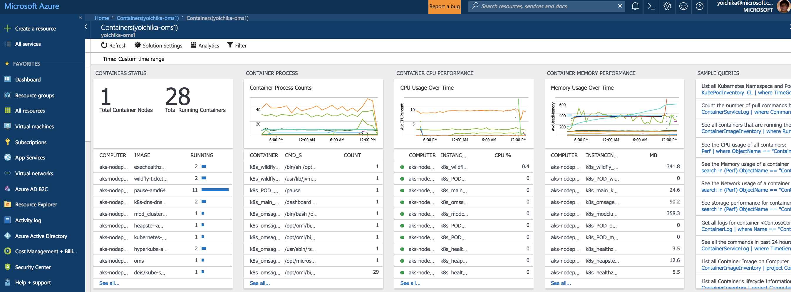

# 05 - Monitoring the Kubernetes Cluster with OMS and Log Analytics

## Create OMS workspace

Create a new OMS workspace and get a workspace ID and primary key for it by following this guide - [Configure the monitoring solution](https://docs.microsoft.com/en-us/azure/aks/tutorial-kubernetes-monitor#configure-the-monitoring-solution).

## Deploy OMS/Log Analytics DaemonSet Agent in the Cluster

Once you have the workspace ID and primary key of your OMS workspace, replace the values for WSID and KEY with your values in `kubernetes/oms-daemonset.yaml`
```
containers:
- name: omsagent
    image: "microsoft/oms"
    imagePullPolicy: Always
    env:
    - name: WSID
        value: <WSID>
    - name: KEY
        value: <KEY>
```

Then, install the OMS daemonset by running the following command:
```
kubectl create -f kubernetes/oms-daemonset.yaml --record
```

Check if new Pod and DaemonSet for OMS agent are running:
```
kubectl get po,ds -l context=AKSDemo

(Sample Output)
NAME                            READY     STATUS    RESTARTS   AGE
po/modcluster-500718032-kfb17   1/1       Running   0          1h
po/omsagent-hsc5r               1/1       Running   0          57s
po/wildfly-1364584080-2qswl     1/1       Running   0          1h

NAME          DESIRED   CURRENT   READY     UP-TO-DATE   AVAILABLE   NODE SELECTOR                 AGE
ds/omsagent   1         1         1         1            1           beta.kubernetes.io/os=linux   58s
```

After this is completed, OMS starts collect metrics and logs from the cluster. Here are the OMS container solution dashboard screen capture:


