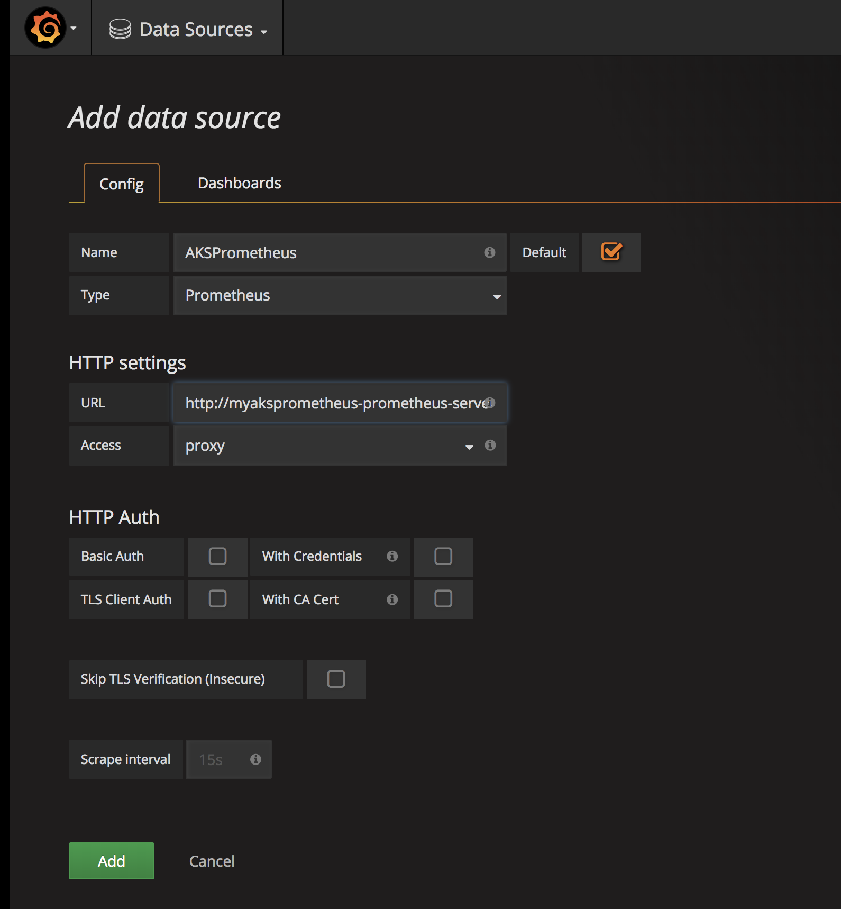
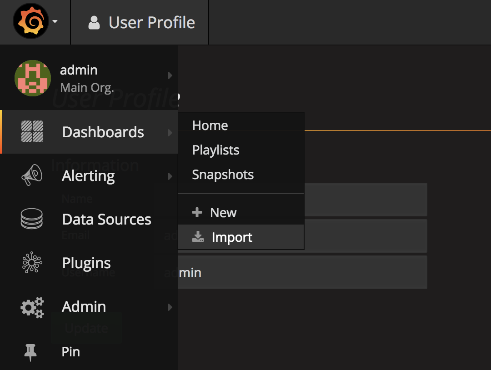
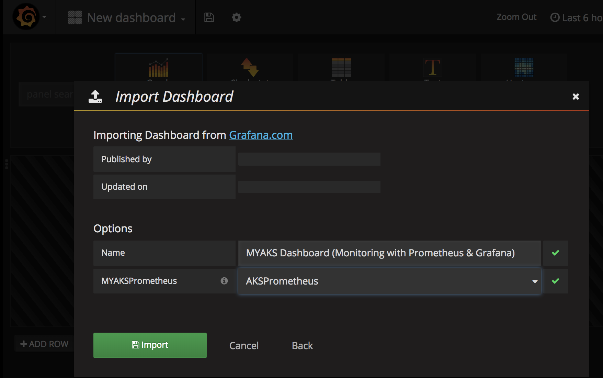
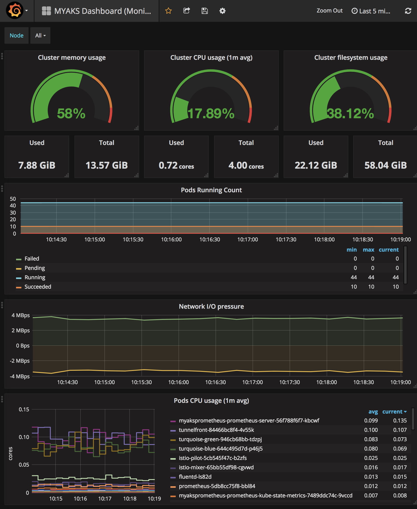

# Monitoring Kubernetes Cluster with Prometheus and Grafana

## Install Prometheus using Helm

Prometheus is a Cloud Native Computing Foundation (CNCF) project used to collect and process metrics. It collects metrics from configured targets, in our case it is a Kubernetes Cluster.

Modified original prometheus-configforhelm.yaml to use Persistent Volume Claim (not to lose data even when PoD terminate) 
```
  persistentVolume:
    ## If true, Prometheus server will create/use a Persistent Volume Claim
    ## If false, use emptyDir
    ##
    #enabled: false  # yoichika
    enabled: true
```

Install Prometheus into the K8s cluster using custom settings
```
helm install --name myaksprometheus stable/prometheus --version 4.6.13 -f prometheus-configforhelm.yaml
```

Validate that Prometheus was installed 
```
kubectl get pods | grep prometheus

kubectl get svc | grep prometheus
```

## Install Grafana using Helm
Grafana is a dashboard visualization tool that can use all kinds of data sources. In our case, Prometheus will be used as the data source.

```
# helm install --name myaksgrafana stable/grafana --version 0.5.1 --set server.service.type=LoadBalancer,server.adminUser=admin,server.adminPassword=admin,server.image=grafana/grafana:4.6.3,server.persistentVolume.enabled=false
helm install --name myaksgrafana stable/grafana --version 0.5.1 --set server.service.type=LoadBalancer,server.adminUser=admin,server.adminPassword=admin,server.image=grafana/grafana:4.6.3,server.persistentVolume.enabled=true
```
[NOTE]
- We are setting the default username and password to admin to make it easier to remember
- We are also setting the service type to LoadBalancer to expose the service outside of the cluster and make it accessible via the Internet
- enable server PersistentVolume so as not to lose data even when PoD terminated

Validate that Grafana was installed 
```
kubectl get pods | grep grafana
myaksgrafana-grafana-db7d89599-qwggj                             1/1       Running   0          7m

kubectl get svc | grep grafana
myaksgrafana-grafana                            LoadBalancer   10.0.115.192   52.234.224.18   80:31630/TCP     8m
```

Test Grafana UI (user admin:admin for user & password)
```
open http://52.234.224.18
```

1. login to Grafana (admin:admin)

2. Add Prometheus as a Data Source
    - AKSPrometheus / Type: Prometheus
    - Use http://myaksprometheus-prometheus-server:9090 for the URL in the HTTP settings.
    - Once you have filled in the values similar to the screenshot above, click the Add button and ensure no errors come back.


3. Add K8s Monitoring Dashboard to Grafana
Go to import dashboards via the menu in the top left



Finally press `import button` to import.




## How to Delete Prometheus
```
helm ls --all myaksprometheus

NAME            REVISION        UPDATED                         STATUS  CHART                   NAMESPACE
myaksprometheus 1               Sat Apr  7 09:35:30 2018        DELETED prometheus-4.6.13       default

helm del --purge myaksprometheus 
```
